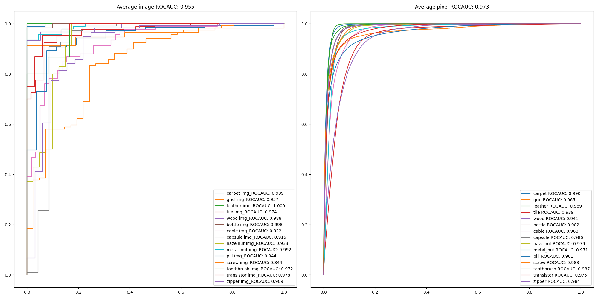
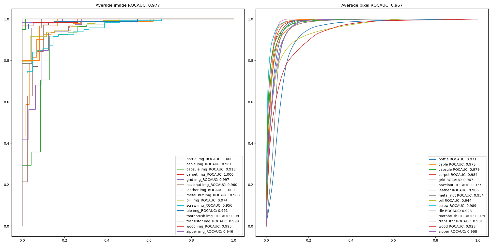
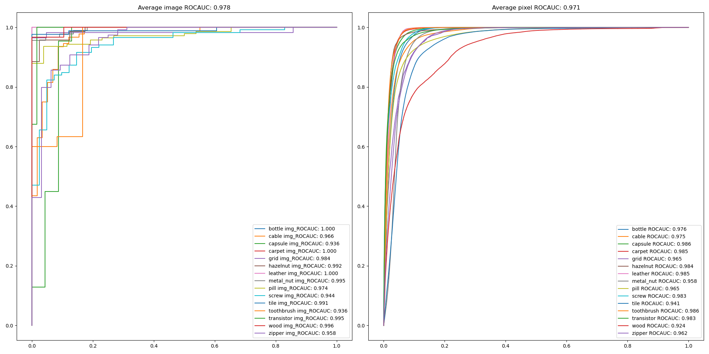

# PaDiM-EfficientNetV2

Both PaDiM-EfficientNetV2 and PaDiM-EfficentNet_NS outperform PaDiM-WR50-Rd550 from original implementation on image-level ROCAUC significantly by over **2%** !!!

## Features

* The current SOTA from EfficentNet family, EfficientNetV2 and EfficentNet_NS(Noisy Student), are used as the feature extractor
* The cov_inv instead of cov is saved to speed up the calculation of mahalanobis distance
* Optimize both torch and numpy methods to calculate mahalanobis distance
* Save train params, mean and cov_inv, in hdf5 format instead of pickle in case of OOM issue when memory is limited
* Add PCA and NPCA to reduce feature dimensionality

## Requirement

* Packages
  * python == 3.8.5
  * pytorch == 1.12 (lower version might work but not verified)
  * tqdm
  * sklearn
  * matplotlib
  * timm
* Both EfficientNetV2 and EfficientNet_NS models are imported from timm (pytorch-image-models)

## Datasets

MVTec AD datasets : Download from [MVTec website](https://www.mvtec.com/company/research/datasets/mvtec-ad/)

## Usage

```bash
python main.py --data_path mvtec_anomaly_detection/ --save_path ./mvtec_result --arch efficientnetv2_m_in21ft1k --use_gpu
python main.py --data_path mvtec_anomaly_detection/ --save_path ./mvtec_result --arch efficientnet_b7_ns --use_gpu
```
### Download pre-trained feature distributions
Download pretrained feature distribution of efficientnetv2_m model from dropbox link [efficientnetv2_m feature distribution](https://www.dropbox.com/sh/ejvum8vqz6fs8t6/AADHfyjnxWxq-w5WJ7kLHkLya?dl=0)

## Results

### Implementation results on MVTec

* Image-level anomaly detection accuracy (ROCAUC)

|        MvTec        | R18-Rd100 |  WR50-Rd550  |   Effi-B7-NS   |    EffiV2-M    |
| :-----------------: | :-------: | :-----------: | :-------------: | :-------------: |
|       Carpet       |   0.984   |     0.999     |  **1.0**  |  **1.0**  |
|        Grid        |   0.898   |     0.957     | **0.997** |      0.984      |
|       Leather       |   0.988   | **1.0** |  **1.0**  |  **1.0**  |
|        Tile        |   0.959   |     0.974     | **0.991** | **0.991** |
|        Wood        |   0.990   |     0.988     |      0.995      | **0.996** |
| All texture classes |   0.964   |     0.984     | **0.997** |      0.994      |
|       Bottle       |   0.996   |     0.998     |  **1.0**  |  **1.0**  |
|        Cable        |   0.855   |     0.922     |      0.961      | **0.966** |
|       Capsule       |   0.870   |     0.915     |      0.913      | **0.936** |
|      Hazelnut      |   0.841   |     0.933     |      0.960      | **0.992** |
|      Metal nut      |   0.974   |     0.992     |      0.988      | **0.995** |
|        Pill        |   0.869   |     0.944     | **0.974** | **0.974** |
|        Screw        |   0.745   |     0.844     | **0.956** |      0.944      |
|     Toothbrush     |   0.947   |     0.972     | **0.981** |      0.936      |
|     Transistor     |   0.925   |     0.978     | **0.999** |      0.995      |
|       Zipper       |   0.741   |     0.909     |      0.946      | **0.958** |
| All object classes |   0.876   |     0.941     |      0.968      | **0.970** |
|     All classes     |   0.905   |     0.955     |      0.977      | **0.978** |

* Pixel-level anomaly detection accuracy (ROCAUC)

|        MvTec        |    R18-Rd100    |   WR50-Rd550   |   Effi-B7-NS   |    EffiV2-M    |
| :-----------------: | :-------------: | :-------------: | :-------------: | :-------------: |
|       Carpet       |      0.988      | **0.990** |      0.984      |      0.985      |
|        Grid        |      0.936      |      0.965      | **0.967** |      0.965      |
|       Leather       | **0.990** |      0.989      |      0.986      |      0.985      |
|        Tile        |      0.917      |      0.939      |      0.923      | **0.941** |
|        Wood        |      0.940      | **0.941** |      0.928      |      0.924      |
| All texture classes |      0.953      | **0.965** |      0.958      |      0.96      |
|       Bottle       |      0.981      | **0.982** |      0.971      |      0.976      |
|        Cable        |      0.949      |      0.968      |      0.973      | **0.975** |
|       Capsule       |      0.982      | **0.986** |      0.979      | **0.986** |
|      Hazelnut      |      0.979      |      0.979      |      0.977      | **0.984** |
|      Metal nut      |      0.967      | **0.971** |      0.954      |      0.958      |
|        Pill        |      0.946      |      0.961      |      0.944      | **0.965** |
|        Screw        |      0.972      |      0.983      | **0.989** |      0.983      |
|     Toothbrush     |      0.986      | **0.987** |      0.979      |      0.986      |
|     Transistor     |      0.968      |      0.975      |      0.981      | **0.983** |
|       Zipper       |      0.976      | **0.984** |      0.968      |      0.962      |
| All object classes |      0.971      | **0.978** |      0.972      |      0.976      |
|     All classes     |      0.965      | **0.973** |      0.967      |      0.971      |

### ROC Curve

* ResNet18


* Wide_ResNet50_2



* Efficientnet-b7_ns



* EfficientnetV2_m



### Typical Localization examples

<p align="center">
    
</p>
<p align="center">
    
</p>
<p align="center">
    
</p>
<p align="center">
    
</p>
<p align="center">
    
</p>

## Reference

[1] Thomas Defard, Aleksandr Setkov, Angelique Loesch, Romaric Audigier. *PaDiM: a Patch Distribution Modeling Framework for Anomaly Detection and Localization*. https://arxiv.org/pdf/2011.08785

[2] Base code. https://github.com/xiahaifeng1995/PaDiM-Anomaly-Detection-Localization-master

[3] The distance of Mahalanobis is replaced by a tensor (attach GPU) base to reduce the inference time. https://github.com/ingbeeedd/PaDiM-EfficientNet
